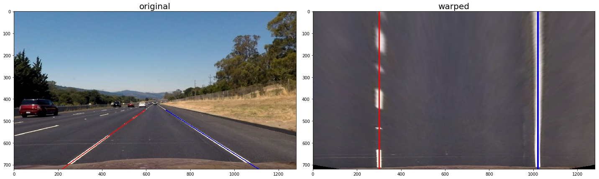

# Advanced Lane Finding Project

## Overview

The goals / steps of this project are the following:

* Compute the camera calibration matrix and distortion coefficients given a set of chessboard images.
* Apply a distortion correction to raw images.
* Use color transforms, gradients, etc., to create a thresholded binary image.
* Apply a perspective transform to rectify binary image ("birds-eye view").
* Detect lane pixels and fit to find the lane boundary.
* Determine the curvature of the lane and vehicle position with respect to center.
* Warp the detected lane boundaries back onto the original image.
* Output visual display of the lane boundaries and numerical estimation of lane curvature and vehicle position.

[//]: # (Image References)

[image1]: ./examples/undistort_output.png "Undistorted"
[image2]: ./test_images/test1.jpg "Road Transformed"
[image3]: ./examples/binary_combo_example.jpg "Binary Example"
[image4]: ./examples/warped_straight_lines.jpg "Warp Example"
[image5]: ./examples/color_fit_lines.jpg "Fit Visual"
[image6]: ./examples/example_output.jpg "Output"
[video1]: ./project_video.mp4 "Video"

## [Rubric](https://review.udacity.com/#!/rubrics/571/view) Points

### Here I will consider the rubric points individually and describe how I addressed each point in my implementation.  

---

### Writeup / README

#### 1. Provide a Writeup / README that includes all the rubric points and how you addressed each one.  You can submit your writeup as markdown or pdf.  [Here](https://github.com/udacity/CarND-Advanced-Lane-Lines/blob/master/writeup_template.md) is a template writeup for this project you can use as a guide and a starting point.  

You're reading it!

### Source code and output files.

The whole project was implemented using the IPython notebook located in the './Project2.ipynb' file. The output images and video are located in the `./output_images/` and `./output_videos/` directories respectively.

### Camera Calibration

The `calibrate` function takes in a sequence of chessboard images, and the chessboard's x and y sizes.

It starts by preparing "object points", which will be the (x, y, z) coordinates of the chessboard corners in the world. Here I am assuming the chessboard is fixed on the (x, y) plane at z=0, such that the object points are the same for each calibration image.  Thus, `objp` is just a replicated array of coordinates, and `objpoints` will be appended with a copy of it every time I successfully detect all chessboard corners in a test image. 

Then it applies the functions `cv2.findChessboardCorners` and `cv2.drawChessboardCorners` to find chessboard corners and draw them onto the images. `imgpoints` will be appended with the (x, y) pixel position of each of the corners in the image plane with each successful chessboard detection.  

It then uses the output `objpoints` and `imgpoints` to compute the camera calibration and distortion coefficients using the `cv2.calibrateCamera()` function. 

This function returns camera matrix and distortion coefficients along with a list of chessbord images.

```python
def calibrate(cal_images, chessboard_nx, chassboard_ny):
	# ...
	return mtx, dist, chessboards
```

### Distortion correction

The `undistort` function takes in an image and uses the `cv2.undistort()` function to remove distortion from the image using the camera matrix and distorion coefficiens calculated in the previous step.

```python
def undistort(img):
    """
    Distortion correction using the parameters gotten after camera calibration
    returns an undistorted image
    """
    return cv2.undistort(img, cal_mtx, cal_dist, None, cal_mtx)
```

I applied the `undistort` function to the test image and obtained this result: 


### Pipeline (single images)

#### 1. Distortion correction.

The first step of my pipeline is applying distortion correction to the input image. I used the method `undistort` described above. 

Here's an example of its output:


#### 2. Color and Gradient thresholding.

The next step of the pipeline is performing color transforms, gradients or other methods to create a thresholded binary image.

The `filter_color_n_gradient` function takes in an image and uses a combination of color and gradient thresholds to generate a binary image.

After trying different combinations of color thresholding I found that thresholding the HLS-S channel works pretty well in good lighting conditions, but does not work well in shadows. Also, the S channel selects too many features under some lighting conditions.

In order to filter out noisy pixels I calculated the gradient direction of the HLS-L channel and overlaped it with the thresholded S channel.

In some cases this approach did not perform well, so as an alternative I calculated x-gradient of the HLS-L channel, so that my final algorithm looked like the following (preudo-code):

```python
def filter_color_n_gradient(img):
	TS = thresholded HLS-S
	GDL = thresholded gradient direction of HLS-L
	XDL = thresholded x-gradient of HLS-L
	
	filtered = img[(TS and GDL) or XDL]
	
   	return filtered
```

Here's an example of this step's output:


#### 3. Perspective transform.

The `birds_eye_view` function takes in an image and applies perspective transform to the image using the OpenCV `cv2.warpPerspective` function.

In order to execute the `cv2.warpPerspective` function I needed to calculate a perspective tranformation matrix `M`. OpenCV provides the `cv2.getPerspectiveTransform` function to do so. This function takes in two parameters `src` and `dest` - source and destination points. I chose to hardcode the source and destination points in the following manner:

```python
top_y = 450

src = np.float32([
    [218,  img_height], # bottom left
    [594,  top_y],      # top left
    [689,  top_y],      # top right
    [1109, img_height]  # bottom right
])

lwx = 300  # left  warped x-coordinate
rwx = 1020 # right warped x-coordinate
dst = np.float32([
    [lwx, img_height], # bottom left
    [lwx, 0],          # top left
    [rwx, 0],          # top right
    [rwx, img_height]  # bottom right
])
```

This resulted in the following source and destination points:

| Source        | Destination   | 
|:-------------:|:-------------:| 
| 218, 720      | 300, 720      | 
| 594, 450      | 300, 0        |
| 689, 450      | 1020, 0       |
| 1109, 720     | 1020, 720     |

I verified that my perspective transform was working as expected by drawing the `src` and `dst` points onto a test image and its warped counterpart to verify that the lines appear parallel in the warped image.



#### 4. Lane-finding

In order to identify lane-line pixels I used the "histogram peaks" and "sliding window" techniques proposed in the lecture 7 of this course.

The `find_lane_pixels` function combines these techniques in the following manner:

- take a histogram across the bottom part of the image
- find the histogram peaks to identify starting positions of the left and right lines
- run sliding window search for each line starting from the positions found in the previous step
- accumulate activated pixels (pixels within a sliding window on each iteration) for the left and right lines separately
- find 2nd order polynomial coefficients using the `np.polyfit` function

Here're a visualization of the algorithm:


#### 5. Radius of Curvature of the lane.

To calculate the radius of curvature of the lane we need to calculate the radius of curvature of the left and right lines separately.

To calculate the radius of curvature I've implemented the `curvature_radius` function. It takes in two paraters: y-value `y` and polinomial coefficients `fit`.

```python
def curvature_radius(y, fit):
    return (1 + (2*fit[0]*y + fit[1])**2)**(3/2) / np.absolute(2*fit[0])  
```

I used the function to calculate the raduis of curvature in meters. To do so I passed `warped_ym_per_px * img_height` as the `y` value, where `warped_ym_per_px` implies the number of meters in a pixel.

Now, having the raduis of curvature of the left and right lines we can calculate the radius of curvature of the lane. It can be calculated as an average of the two:

```python
def pipeline(img, left_det=None, right_det=None, drawLinePixels=False):
	# ...
	left_curverad = left_det.radius_of_curvature
	right_curverad = right_det.radius_of_curvature
	curverad = (left_curverad + right_curverad) // 2
	# ...
```

#### 5. Position of the vehicle with respect to center.

Same with calculating the position of the vehicle with respect to center.

First I calculated the distance of vehicle center from the left and right lines separately using the `line_base_position_m` function:

```python
def line_base_position_m(fit):
    """
    Calculates distance in meters of vehicle center from the line
    """
    line_pos_px = polinomial(img_height, fit)
    line_base_pos_px = line_pos_px - (img_width / 2)
    return line_base_pos_px * warped_xm_per_px  
```

The function will return a positive value for the right line and a negative value for the left. As previously, I will average the two to get ..

```python
def pipeline(img, left_det=None, right_det=None, drawLinePixels=False):
	# ...
	position_m = (right_det.line_base_pos + left_det.line_base_pos) / 2
	# ...
```

If the average value is greater than 0, the vehicle is on the left side of the lane's center, otherwise it is on the right side.

#### 6. Drawing results back to the original image.

I implemented this step in the function `pipeline()` (line 65 to 92). Here is an example of my result on a test images:


---

### Pipeline (video)

#### 1. Smoothing.

In order to smooth lines and prevent jittering I had to keep some state between pipeline calls. I've implemented the class `LineDetector` which keeps N (configurable) recent fits. Each time the `pipeline` function is called it updates the state of line detectors of the left and right lines.

During each update a line detector uses recent fits to calculate

- `best_fit` - polynomial coefficients averaged over the last N iterations
- `radius_of_curvature` - radius of curvature of the line in meters
- `line_base_pos` - distance in meters of vehicle center from the line

#### 2. Sanity check

Before updating the state of `LineDetector`, we should check that the detection makes sense. To do so I've implemented the `sanity_check` function.

It takes in the left and right lines and outputs whether they're correct or not.
The function checks that the lines exist, separated by approximately the right distance horizontally, and roughly parallel.

If the santy check fails the `pipeline` does not update the `LineDetector`.

#### 3. Look-Ahead Filter

Once I've found valid lane lines in one frame of video I'll use the look-ahead filter to not search blindly in the next frame. If the filter fails to find lines I simply fallback to using the sliding window technique.

The `search_around_poly` function takes in a binary warped image along with fits of the left and right lines. It then selects activated pixels within configurable `margin` of the left and right lines.

```python
def search_around_poly(binary_warped, left_fit, right_fit):
	# ...
	return left_line, right_line
```

#### 4. Project video.

Here's a [link to my video result](./output_videos/project_video.mp4)

---

### Discussion 

#### 1. Color and Gradient thresholding

The approach of color and gradient thresholding performed very well. Its flexibility allows one to create variety of image masks to select desired features. However it has a drawback - there are no strict rules how to apply it, so one has to rely on intuition and luck to find the right combination of different color channels, gradients and thresholds.

My solution does not work well under some lighting conditions, and I would like to spend more time to find the right combinations of filters.

#### 2. Sanity check

As it turned out one can't simply compare the radius of curvature of the left and right lines. There're were situation when one line could have the radius equal 60,000 m, while another had the radius equal 4,500m (different order of magnitude). Hovewer, for humans the lines would look very similar.

After many experiments I ended up with the simplified approach: I check if one line can fit into a buffer created from another line +/- some margin (e.g. +/- 100px).


There're four lines on the graph above:

- blue line is the left lane line
- green line is the right lane line
- two red lines form a validation buffer

So if the right line fits into the buffer we say the lines are correct.

#### 3. Buffering

In the first project of this course I used a low-pass filter to smooth lines over time. In this project I decided to keep a buffer of recent fits as it was suggested in the `Tips and Tricks` section of the project description.

I started from averaging them to get `best_fit` - the final `fit` value which I use later in the pipeline. This approach did not worked well as it was too lagging. After some experiments I decided to use weighted average where the latest value in the buffer has the biggest weight. Doing so helped to decrease lag and make the algorithm more responsive to changes in video frames.
